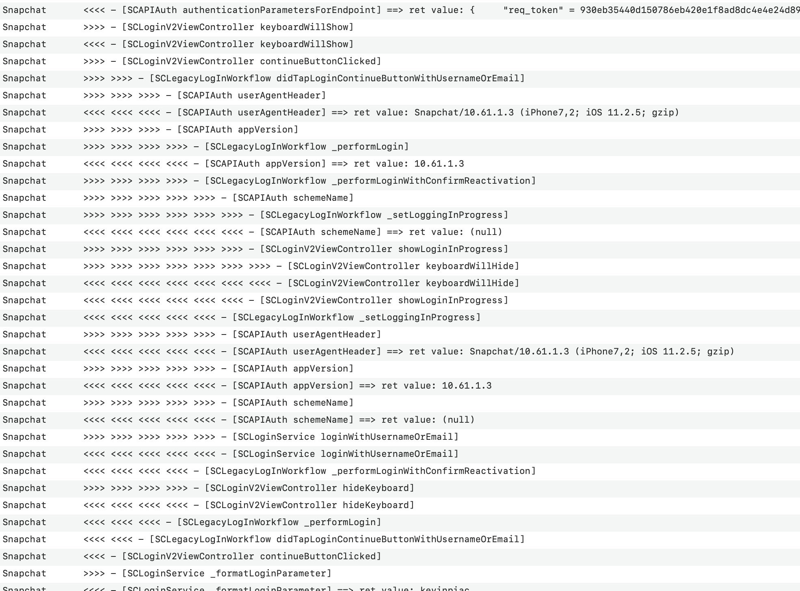

## Getting started

Hookify is a __serious opinionated alternative__ to [Logify](https://github.com/theos/logos/wiki/logify.pl).
Like Logify, Hookify ouputs a hooked version of each method contained in a header file provided by classdump utility but with the following differences :
- __Hookify works with a custom logs method : `[LogTool logDataFromNSString]`.__

 This method allows you to take the control over your logged data. You can choose either to log your data into a file, in the console and/or simply change the log format.
- __Hookify logs data at the begining of the hooked method AND also just before it returns__.

Hookify logs ```>>>> [ClassName MethodName paramValue1 paramValue2...]``` when a hooked method is called and ```<<<< [ClassName MethodName] return value (if any)``` before it returns. This format is especially helpfull when you need to understand an app workflow.


### Example output :



### Usage

#### Hook an entire directory of dumped headers:

The option `-d (or --dir)` allows you to hook an entire directory of dumped headers. Because huge apps can contains more than 20K header files, hookify works with pattern matching as follow:

__Using pre-made pattern:__

You can use a pre-made regex option `-p (or --pattern)` to filter classes responsible of either Encryption or Networking (and more to come) using `-p crypto` OR  `-p network` options.


```sh
python hookify.py -d ../mydirpath -p network
# OR
python hookify.py -d ../mydirpath -p crypto
```

__Using a custom regex pattern:__

`-r (or --regex)` option allows you to filter classes using your own custom pattern.


```sh
python hookify.py -d ../mydirpath -r "([a-z_0-4]*)"
```


#### Hook an entire class using single header file:

The `-f (or --file)` option allows you to give a single file path to hookify.


```sh
python hookify.py -f ../myfilepath
```


### Getting started :

#### 1. Preparing the Log Class and Methods.

In order to get a similar result as the output above, you'll have to copy past the following snippet in your tweak file (let's say `your_tweak.xm`).

This is a small interface which allows your tweak to log each call with the right indentation at the begining and the end of each logified methods.

``` objective-c
@interface LogTool: NSObject
@property int numberOfTabs;

+ (LogTool *)sharedInstance;
+ (void)logDataFromNSString: (NSString *)logContent;
+ (NSString *)prepend: (int)count string: (NSString*)toPrepend toString: (NSString *)originalString;
@end

@implementation LogTool
+(LogTool *)sharedInstance {
  static LogTool *sharedInstance = nil;
  static dispatch_once_t onceToken;
  dispatch_once(&onceToken, ^{
      sharedInstance = [[LogTool alloc] init];
      // Do any other initialisation stuff here
      sharedInstance.numberOfTabs = -1;
  });
  return sharedInstance;
}
+ (NSString *)prepend: (int)count string: (NSString*)toPrepend toString: (NSString *)originalString {
  NSString *newString = [NSString stringWithFormat: @"%@", originalString];

  while (count > 0) {
    newString = [NSString stringWithFormat: @"%@%@", toPrepend, newString];
    count--;
  }
  return newString;
}
+ (void)logDataFromNSString: (NSString *)logContent
{
  LogTool *logTool = [LogTool sharedInstance];
  BOOL isBegin = [logContent containsString:@">>>> -"];
  BOOL isEnd = [logContent containsString:@"<<<< -"];
  NSString *toPrint = [NSString stringWithFormat: @"%@", logContent];

  if (isBegin) {
    logTool.numberOfTabs = logTool.numberOfTabs + 1;
    toPrint = [LogTool prepend: logTool.numberOfTabs string: @">>>> " toString: logContent];
  } else if (isEnd) {
    toPrint = [LogTool prepend: logTool.numberOfTabs string: @"<<<< " toString: logContent];
    logTool.numberOfTabs = logTool.numberOfTabs - 1;
  } else {
    toPrint = [LogTool prepend: logTool.numberOfTabs string: @"---- " toString: logContent];
  }
  NSLog(@"%@", toPrint);
}
@end

```

#### 2. Preparing the Log Class and Methods.


Once it's done you can use hookify to generate hooked methods.


``` sh
python hookify.py ./path_to_your_header_generated_with_classdump.h >> your_tweak.xm
```

Sample output in your_tweak.xm
``` objective-c

+ (void)logMediaDownloadEventWithRequest:(id)arg1 response:(id)arg2 parameters:(id)arg3 {[logTool logDataFromNSString:@">>>> BEGIN - [SCAPIClient logMediaDownloadEventWithRequest]"];%orig;[logTool logDataFromNSString:@"<<<< END - [SCAPIClient logMediaDownloadEventWithRequest]"]; }
- (void)observeValueForKeyPath:(id)arg1 ofObject:(id)arg2 change:(id)arg3 context:(void *)arg4 {[logTool logDataFromNSString:@">>>> BEGIN - [SCAPIClient observeValueForKeyPath]"];%orig;[logTool logDataFromNSString:@"<<<< END - [SCAPIClient observeValueForKeyPath]"]; }
- (void)enqueueHTTPRequestOperation:(id)arg1 {[logTool logDataFromNSString:@">>>> BEGIN - [SCAPIClient enqueueHTTPRequestOperation]"];%orig;[logTool logDataFromNSString:@"<<<< END - [SCAPIClient enqueueHTTPRequestOperation]"]; }
```

You're all set! Now, go on `XCode > Devices > [yourdevice] > Open Console` and all your logs will appear there.


##### Other solution, output logs into a file:

Sometime we prefer to output logs into a file. Here is an example of interface which outputs logs directly in a file located at `/tmp/filelog.txt`.
Note : this interface will not handle indentation but you can mix both examples for that ;)

``` objective-c
// your_tweak.xm
@interface LogTool: NSObject
+ (void)logDataFromNSString: (NSString *)logContent;
@end

@implementation LogTool
+ (void)logDataFromNSString: (NSString *)logContent
{
    NSFileHandle *file;
    NSData *data;

    file = [NSFileHandle fileHandleForUpdatingAtPath: @"/tmp/filelog.txt"];

    [file seekToEndOfFile];

    logContent = [logContent stringByAppendingString:@"\n------------\n"];
    data = [logContent dataUsingEncoding:NSUTF8StringEncoding];

    [file writeData: data];

    [file closeFile];
}
@end
